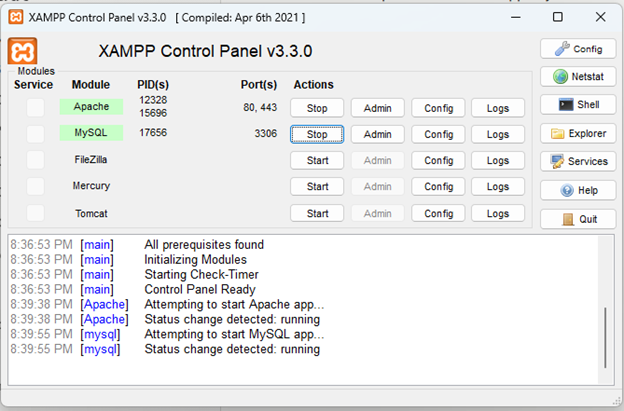
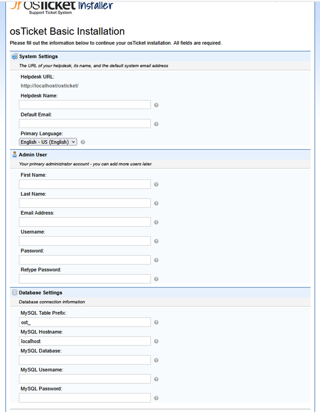
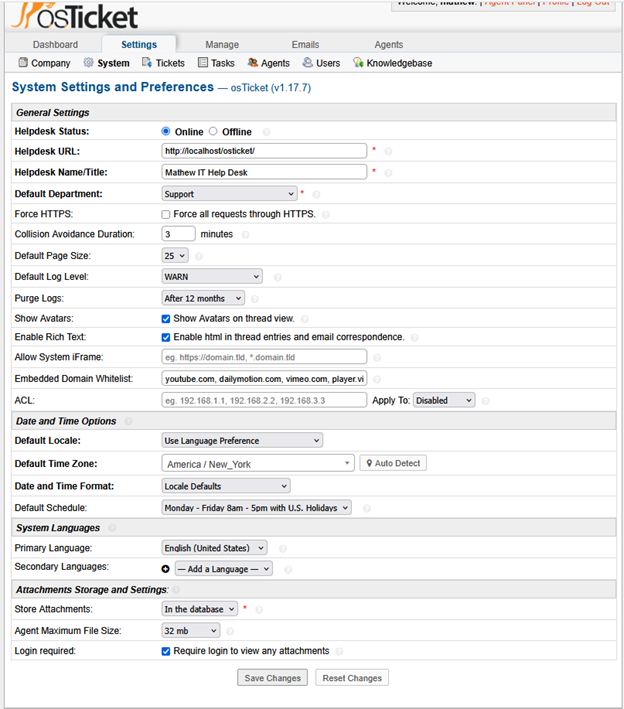
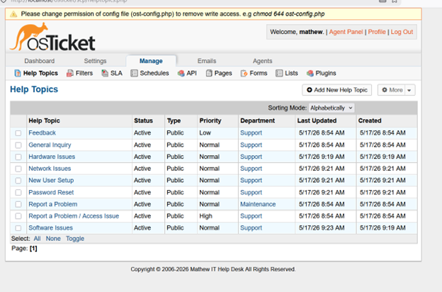
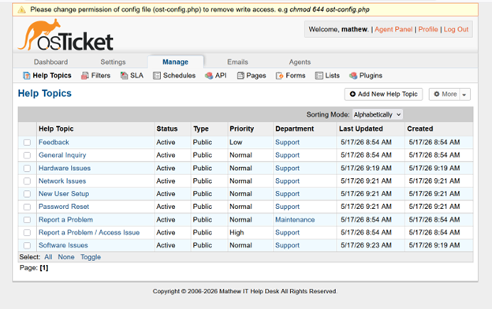
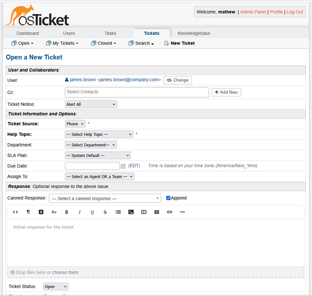
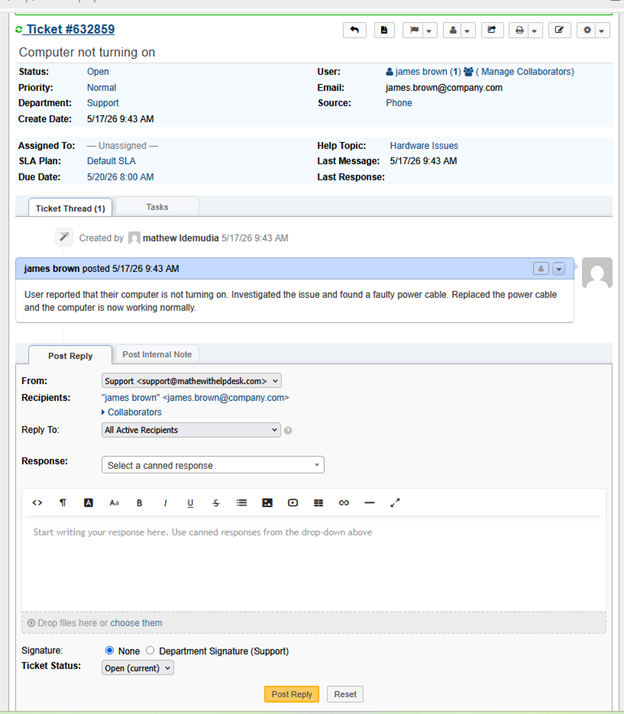
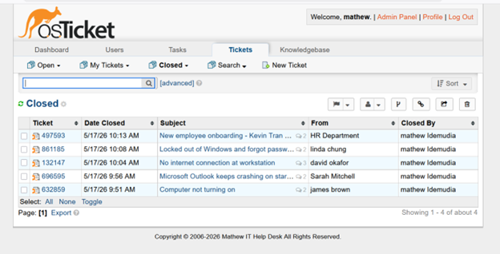

# osTicket Help Desk Lab

A hands-on IT support lab built using osTicket, an open-source help desk ticketing system. This project demonstrates real-world IT support workflows including ticket creation, triage, resolution, and closure across five common help desk categories.

---

## Environment

| Component | Details |
|-----------|---------|
| OS | Windows 11 |
| Web Server | XAMPP (Apache) |
| PHP Version | 8.2.12 |
| Database | MySQL via phpMyAdmin |
| Ticketing System | osTicket v1.17.7 |
| URL | http://localhost/osticket |

---

## Help Topics Configured

- Hardware Issues
- Software Issues
- Network Issues
- Password Reset
- New User Setup

---

## Tickets Completed

### Ticket 1 — Hardware Issues
| Field | Details |
|-------|---------|
| Ticket # | 632859 |
| User | James Brown |
| Subject | Computer not turning on |
| Priority | Normal |
| Status | Closed |
| Resolution | Investigated and found a faulty power cable. Replaced the power cable and confirmed the computer powers on normally. |

---

### Ticket 2 — Software Issues
| Field | Details |
|-------|---------|
| Ticket # | 696595 |
| User | Sarah Mitchell |
| Subject | Microsoft Outlook keeps crashing on startup |
| Priority | Normal |
| Status | Closed |
| Resolution | Ran Outlook in safe mode (outlook.exe /safe). Identified and disabled faulty Zoom Outlook Plugin add-in. Confirmed stable launch. Advised user to update the plugin when a new version is available. |

---

### Ticket 3 — Network Issues
| Field | Details |
|-------|---------|
| Ticket # | 132147 |
| User | David Okafor |
| Subject | No internet connection at workstation |
| Priority | High |
| Status | Closed |
| Resolution | Found Ethernet cable partially unseated at wall jack. Reseated cable and ran ipconfig /release and /renew to obtain fresh IP address. Internet connection fully restored. |

---

### Ticket 4 — Password Reset
| Field | Details |
|-------|---------|
| Ticket # | 861185 |
| User | Linda Chung |
| Subject | Locked out of Windows — forgot password |
| Priority | High |
| Status | Closed |
| Resolution | Verified identity via employee ID and manager confirmation. Unlocked account in Active Directory. Reset temporary password with forced change at next login. Advised user on password policy (12+ characters, 90-day rotation). |

---

### Ticket 5 — New User Setup
| Field | Details |
|-------|---------|
| Ticket # | 497593 |
| User | HR Department (Kevin Tran) |
| Subject | New employee onboarding — Kevin Tran starts Monday |
| Priority | Normal |
| Status | Closed |
| Resolution | Created Active Directory account with Sales group permissions. Assigned Microsoft 365 license and configured Outlook. Set up workstation with required software. Prepared welcome credentials for first day. |

---

## Screenshots

**XAMPP Control Panel — Apache and MySQL running**

---

**osTicket v1.17.7 Installer — PHP 8.2.12 verified**

---

**osTicket Basic Installation configuration page**

---

**Successful installation confirmation**

---

**Mathew IT Help Desk — system settings configured**

---

**Five help topic categories in staff panel**

---

**Help topics configured in admin panel**

---

**Creating a new ticket for James Brown**

---

**Ticket #632859 open — Hardware Issues (James Brown)**

---

**All 5 tickets closed by Mathew Idemudia**

---

## Skills Demonstrated

- Help desk ticketing system installation and configuration
- Ticket lifecycle management (create → assign → resolve → close)
- IT troubleshooting across hardware, software, and network categories
- Active Directory account management and password reset procedures
- New user onboarding and workstation setup
- SLA awareness and ticket prioritization
- Documentation and technical writing

---

## Author

**Mathew Idemudia**
IT Support & Helpdesk Professional | Full-Stack Developer
Oshawa, ON | Open to Work across Canada
[GitHub](https://github.com/osasna1) | id.mathew@outlook.com
